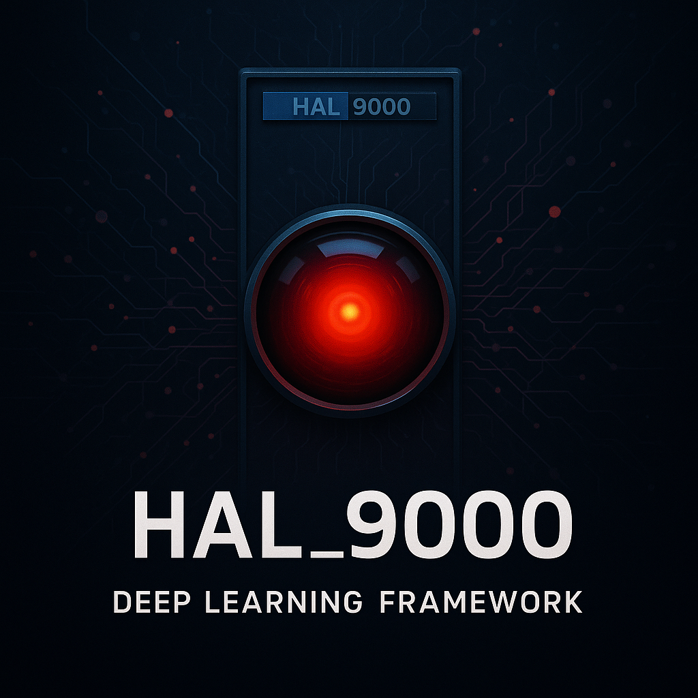

# HAL_9000 Deep Learning Framework

HAL_9000 is not just another deep-learning framework, it’s your launchpad into intelligent, modular, and high-performance neural nets. Built from scratch in Python with inspiration from Keras, HAL_9000 gives you everything from LSTM and vanilla RNNs to ConvNets, DQNs, and complete regularization & optimizer support. Plug in, train fast, and build smarter.

to install the latest version of the framework:

    pip install git+https://github.com/zer0sh0t/HAL_9000

to install the framework from pypi:

    pip install HAL-9000

workflow of this framework is inspired by Keras.  
as of now, HAL_9000 offers:  
7 different variants of NNs:

- perceptron
- multilayer perceptron
- dense net
- conv net
- vanilla rnn
- lstm
- dqn

several regularization methods:

- batch norm
- layer norm
- dropout

optimizers:

- adam
- rmsprop
- sgd

`HAL_9000` -> source code for the library  
`examples` -> guide for using HAL_9000
